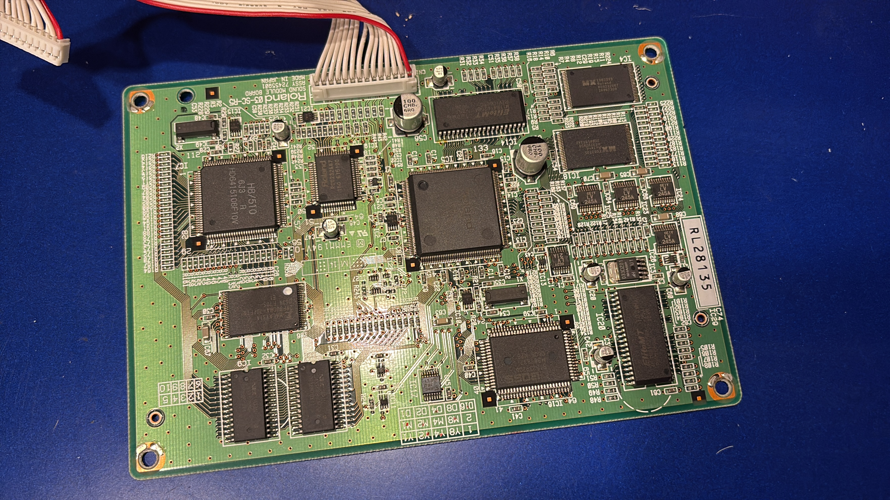

# karaoke-midi-board
Information for analyzing and using the  MIDI module in Japanese karaoke machines.

## License
MIT License

## Author,thanks
applesorce, 2025  
denno enzanki, 2025  
bakuteikozo,2025  

# これは何？

カラオケマシンのMIDIボードを分析してみたものです。
主に日本で通信カラオケ・・と呼ばれるものに利用されているボードを解析したものを整理して乗せています。
開発などにご利用ください。

ボードを高値で転売するとか買い占めるとか、アホなことをせずにみんなで仲良くたのしみましょう。
ボードを外したのこりはスクラップ屋さんで処分して、リサイクルしましょう。
ヤフオクにサウンドボード抜いたことを黙って流して売ろうと思わない。

# Roland系
特に指定がない限りはPINOUTは共通  
B14B-PH-K
~~~
1.VCC
2.VCC
3.GND
4.GND
5.dataC
6.LRCK
7.BCLK(256fs)
8.GND
9.RX02
10.RX03
11.TX02
12.dataD
13.Reset
14.GND
~~~

sound formatは32khzの右寄せ18bit、SC-88系のよくあるデジタルサウンドフォーマット  

- DAM-G70(DAM)
03-SC-R5  
クロスケーブル付き  
SC-88Pro系・・・SC-88PROのバグの再現が行われているので88pro相当品  
SC-55やSC-88の音がでるmapモードある？  
[xでの言及](https://x.com/applesorce/status/1939278572646289752)  
 EFXの再現も行われるので使い勝手は良いボード  
※03-SC-R4との違いは、3.3vのromを扱うためのレベルコンバータが増えたぐらい、それ以外は同じ  
DAM系はサウンドモジュールが最下層にあるため、野ざらし個体の場合サビがうつってる場合あり。  

- DAM-G30(DAM)
03-SC-R4  
クロスケーブル付き  
DAM系はサウンドモジュールが最下層にあるため、野ざらし個体の場合サビがうつってる場合あり。  

- JS-30-VL(ジョイサウンド)
03-SC-R4  
JS-30と見比べづらいが、HypoerjoyのロゴがついていればVL
クロスケーブル付き  
R5との違いはさほどない。  
ケースを開けてすぐ取り出せるので優秀。  

- JS-30
03-SC-R  
クロスケーブル付き  
構成はR5,R4とほぼ同じ  

- BMB neon-R NMU-R10(UGA)
01-SC-NK2    
※SC88とSC-55の音がでる、中途半端気味  
ボードは小型なのでMIDIドーター向け  
***付属のケーブルはストレートなので、上のR4やR5の再生ボードにそのままつなぐと壊れます！***  
モデムのすぐ裏についてる。これも取り外しは容易

## 不明

- JS-W1（ジョイサウンド）
02-SCH-BR2

# Yamaha系
- DAM-G50,DAM-G128  
TG XU9477  
YAMAHA系のボード、音源構成はまだ不明だが、部品が並列で乗っており、音源は実質2台あるMIDIも4ポート分あり
DACも2個乗っており、ステレオで2系統出力あり
電源は5v,GND,+12V,COM,-12Vが必要

以下調査中につき未完成
~~~
赤いところをpin1としてカウント,上下にピンカウントするものとする
1.MIDI-OUTA
2.MIDI-OUTB
3.MIDI-OUTC
4.MIDI-INA
5.MIDI-INB
6.MIDI-INC
7.MIDI-IND
8.MIDI-INE
9.BCO(BitClock?)
10.SYW(LRCK?)
11.SDOUT0(DATA0)
12.SDOUT1(DATA1)
13.SDIN0
14.SDIN1
15.SDIN2
16.SDIN3
17./RESET
18.GND
19.256fs
20.GND
~~~
Sound formatは未調査。